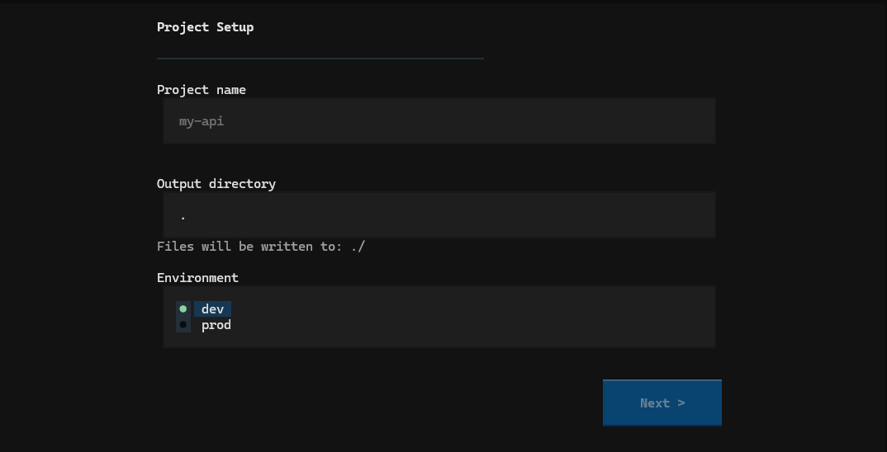

# dockerwiz

> Generate production-ready Docker setups through an interactive terminal wizard.

dockerwiz removes Docker setup friction. Run one command, walk through a 6-screen TUI wizard, and get a complete `Dockerfile`, `docker-compose.yml`, `.env.example`, `Makefile`, and more — tailored to your stack, ready to use.

```
$ dockerwiz new
```



---

## Why dockerwiz

Setting up Docker for a new project is repetitive and error-prone: multi-stage builds, non-root users, healthchecks, bind mounts for dev, volume-less prod, `.dockerignore` tuned to your language, Compose networks and dependencies wired up correctly. dockerwiz handles all of that through a guided wizard so you start with a production-aware setup from day one.

**Where to use it:**

- Bootstrapping a new API or web service with Docker
- Standardising Docker setup across a team
- Learning Docker best practices through generated examples
- CI environments where repeatable Docker scaffolds are needed

---

## Installation

```bash
# Recommended — isolated install via pipx
pipx install dockerwiz

# Or with pip
pip install dockerwiz
```

**From source:**

```bash
git clone https://github.com/TaukTauk/dockerwiz
cd dockerwiz
pip install -e .
```

**Requires:** Python 3.11+ and Docker (for operational commands — `start`, `health`, `shell`, `clean`).

---

## Quick Start

```bash
# 1. Generate a Docker setup
dockerwiz new

# 2. Start the containers
dockerwiz start

# 3. Check everything is healthy
dockerwiz health

# 4. Exec into a container
dockerwiz shell app
```

---

## Commands

Every command supports `--help` for quick in-terminal reference:

```bash
dockerwiz --help
dockerwiz clean --help
dockerwiz config set --help
```

| Command | Description |
|---|---|
| `dockerwiz new` | Launch the 6-screen TUI wizard |
| `dockerwiz start [service]` | Start Docker Compose services |
| `dockerwiz health` | Diagnose the Docker setup in the current directory |
| `dockerwiz shell <service>` | Exec into a running container |
| `dockerwiz clean` | Remove unused containers, images, and volumes |
| `dockerwiz config` | Manage user preferences |
| `dockerwiz list stacks` | Show all supported language/framework stacks |
| `dockerwiz list services` | Show all supported services |
| `dockerwiz version` | Show the installed version |

### `dockerwiz new`

Launches the interactive TUI wizard. Walk through 6 screens:

1. **Project Setup** — name, output directory, environment (dev / prod)
2. **Language & Framework** — language, framework, base image version
3. **Services** — checkboxes for PostgreSQL, MySQL, Redis, Nginx, MongoDB
4. **Configuration** — app port, DB credentials
5. **Review Summary** — file list, conflict warnings
6. **Generating** — per-file progress, next steps on success

### `dockerwiz start [service]`

Starts Docker Compose services for the project in the current directory. Verifies Docker is installed and running, then runs `docker compose up -d`. Pass an optional service name to start a single service.

```bash
dockerwiz start           # start all services
dockerwiz start app       # start only the app service
```

### `dockerwiz health`

Validates `docker-compose.yml` syntax and reports the state of all running containers.

```
  [OK  ]   docker-compose.yml        valid syntax
  [OK  ]   my-api_app_1              running (healthy)
  [FAIL]   my-api_postgres_1         unhealthy
```

### `dockerwiz shell <service>`

Execs into a running container. Auto-selects `bash` first, falls back to `sh`. For database services, launches the appropriate client:

| Service | Client |
|---|---|
| `postgres` | `psql` |
| `mysql` | `mysql` |
| `redis` | `redis-cli` |
| `mongo` | `mongosh` |

### `dockerwiz clean`

Lists stopped containers and dangling images, then prompts for confirmation before removing them.

```bash
dockerwiz clean               # interactive — removes containers + images by default
dockerwiz clean --volumes     # also remove unused volumes
dockerwiz clean --force       # skip confirmation prompt
```

| Flag | Short | Description |
|---|---|---|
| `--all` | | Remove containers, images, and volumes |
| `--containers` | | Stopped containers only |
| `--images` | | Dangling images only |
| `--volumes` | | Unused volumes only |
| `--force` | `-f` | Skip confirmation prompt |

When no flag is given, both containers and images are removed (volumes are never removed unless explicitly requested).

### `dockerwiz config`

Persists preferences to `~/.dockerwiz/config.toml`.

```bash
dockerwiz config set default.language python
dockerwiz config set default.environment prod
dockerwiz config set cache.ttl_hours 48
dockerwiz config list
dockerwiz config get default.language
dockerwiz config unset default.language
```

Available keys:

| Key | Default | Description |
|---|---|---|
| `default.language` | — | Pre-select language in wizard |
| `default.framework` | — | Pre-select framework in wizard |
| `default.environment` | `dev` | Default environment (dev/prod) |
| `default.db` | — | Pre-select database service |
| `cache.ttl_hours` | `24` | Docker Hub cache TTL |
| `output.directory` | `.` | Default output directory |
| `docker_hub.timeout_seconds` | `5` | HTTP timeout for Docker Hub API calls |

---

## Supported Stacks

| Language | Framework | Default Port | Dev Hot-Reload |
|---|---|---|---|
| Python | FastAPI | 8000 | `uvicorn --reload` |
| Python | Django | 8000 | `manage.py runserver` |
| Go | Gin | 8080 | Air |
| Go | Echo | 8080 | Air |
| Node.js | Express | 3000 | nodemon |
| Node.js | NestJS | 3000 | `nest start --watch` |

---

## Supported Services

| Service | Image | Port | Mutex Group |
|---|---|---|---|
| PostgreSQL | `postgres:16-alpine` | 5432 | `db` |
| MySQL | `mysql:8.0` | 3306 | `db` |
| Redis | `redis:7-alpine` | 6379 | — |
| Nginx | `nginx:alpine` | 80 | — |
| MongoDB | `mongo:7` | 27017 | — |

PostgreSQL and MySQL share mutex group `db` — they cannot both be selected in the same project.

---

## Generated Files

| File | Contents |
|---|---|
| `Dockerfile` | Single-stage (dev) or multi-stage (prod), non-root user in prod |
| `docker-compose.yml` | App + services with healthchecks, volumes, networks |
| `docker-compose.override.yml` | Dev-only: source volume mount + DEBUG env (omitted in prod) |
| `.dockerignore` | Language-tailored exclusions |
| `.env.example` | All env vars with safe placeholder values |
| `Makefile` | `make up/down/logs/shell/build/restart/db/help` |
| `nginx.conf` | Reverse proxy config (only when Nginx is selected) |

### Dev vs Prod

| Aspect | dev | prod |
|---|---|---|
| Dockerfile stages | Single stage | Multi-stage build |
| Hot-reload | Enabled | Disabled |
| Volume mounts | Source code mounted | No mounts |
| User | root | Non-root user |
| Dev dependencies | Installed | Excluded |

---

## User Files

dockerwiz stores its data in `~/.dockerwiz/`:

```
~/.dockerwiz/
├── config.toml      # user preferences
├── cache.json       # Docker Hub version cache (TTL 24h)
├── templates/       # optional user template overrides
└── logs/
    └── debug.log    # full tracebacks on unexpected errors
```

### Template Overrides

Place a template file at `~/.dockerwiz/templates/<language>/<framework>/<file>.j2` to override a built-in template. dockerwiz loads user templates first and falls back to built-ins.

---

## Docker Hub Version Fetching

At startup, `dockerwiz new` queries the Docker Hub API for current image tags for Python, Go, and Node.js. Results are cached at `~/.dockerwiz/cache.json` with a 24-hour TTL (configurable via `cache.ttl_hours`). If offline, dockerwiz falls back to hardcoded versions and shows a notice in the wizard.

---

## Tech Stack

dockerwiz is built with:

| Concern | Tool |
|---|---|
| Language | Python 3.11+ |
| TUI framework | [Textual](https://github.com/Textualize/textual) |
| CLI framework | [Typer](https://typer.tiangolo.com) |
| Templating | [Jinja2](https://jinja.palletsprojects.com) |
| HTTP client | [httpx](https://www.python-httpx.org) (async) |
| Docker SDK | [docker-py](https://docker-py.readthedocs.io) |
| Data validation | [Pydantic v2](https://docs.pydantic.dev) |
| Terminal output | [Rich](https://github.com/Textualize/rich) |
| Config files | `tomllib` (stdlib) + `tomli-w` |
| Project manager | [Hatch](https://hatch.pypa.io) |
| Linter | [Ruff](https://docs.astral.sh/ruff) |
| Type checker | [Mypy](https://mypy.readthedocs.io) (strict) |
| Tests | [Pytest](https://pytest.org) + snapshot testing |

---

## Contributing

See [CONTRIBUTING.md](CONTRIBUTING.md) for setup instructions, commit conventions, and how to add new stacks or services.

## Security

See [SECURITY.md](SECURITY.md) for the vulnerability reporting policy.

## License

[MIT](LICENSE) — Copyright (c) 2026 Tauk Tauk

---

> dockerwiz is an independent open source project and is not affiliated with or endorsed by Docker Inc.
